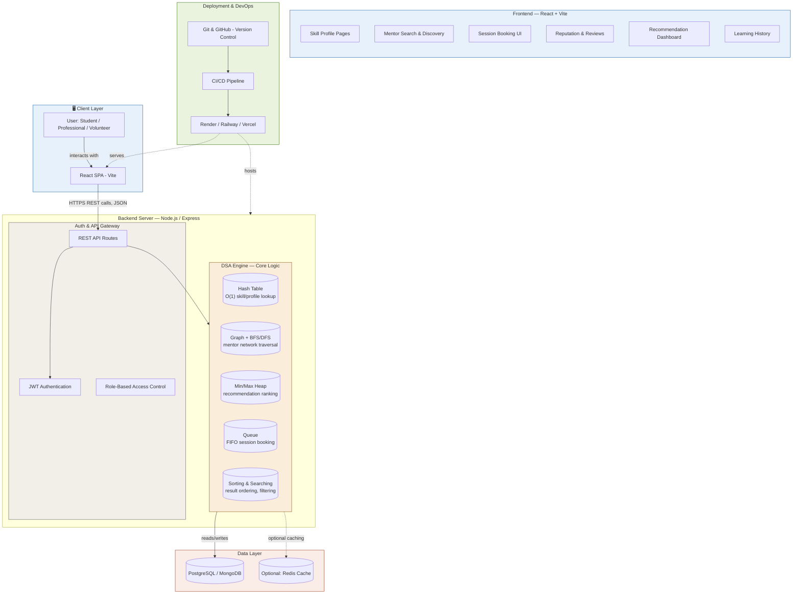

## Local Skill Exchange and Community Learning Platform

A peer-to-peer learning platform connecting students, professionals, and volunteers within universities and local communities  built with real-world Data Structures & Algorithms at its core.

## Table of Contents
- About the Project
- Motivation
- Features
- DSA Focus
- System Architecture
- Tech Stack
- Getting Started
- Project Structure
- API Overview
- Team
- Roadmap
  
## About the Project

Local Skill Exchange and Community Learning Platform is a full-stack web application that enables people to teach and learn skills from each other within their local community or university. Users can create skill profiles, search for mentors, book learning sessions, build reputation through reviews, and receive personalized mentor recommendations, all powered by efficient data structures and algorithms under the hood.

This project was built as part of a DSA group project with the goal of applying core computer science concepts to a real, usable system rather than isolated coding exercises.

## Motivation

Finding the right mentor or peer to learn a new skill from is often difficult, especially outside formal institutions. This platform encourages peer-to-peer learning by making it easy to discover people with the skills you want to learn, connect with them, and build a track record of learning and teaching within your community.

## Users
- Students — looking to learn new skills from peers
- Professionals — sharing expertise and mentoring others
- Volunteers — supporting community learning initiatives

 
 ## Features
Feature	Description
-  Skill Profiles	Users create profiles listing skills they can teach and want to learn
- Mentor Search	Find mentors based on skill, availability, and relevance
- Session Booking	Schedule and manage 1:1 or group learning sessions
- Reputation System	Ratings and reviews build trust between users
- Recommendation Engine	Suggests the best-fit mentors based on ranking algorithms
- Learning History	Tracks past sessions, skills learned, and progress over time

## DSA Focus

| Feature | Data Structure / Algorithm | Purpose |
|---|---|---|
| Skill Profile Lookup | **Hash Table** | O(1) average-time lookup of users by skill |
| Mentor Network | **Graph + Traversal (BFS/DFS)** | Models connections between users, powers mentor discovery |
| Recommendation Ranking | **Heap (Priority Queue)** | Keeps top-ranked mentor suggestions efficiently sorted |
| Session Booking | **Queue** | Manages booking requests in order (FIFO) |
| Search Results | **Sorting & Searching Algorithms** | Orders and filters skill/mentor listings |
| Mentor Matching Research | **Graph Traversal + Ranking Comparison** | Evaluates different mentor-recommendation strategies |

## System architecture

