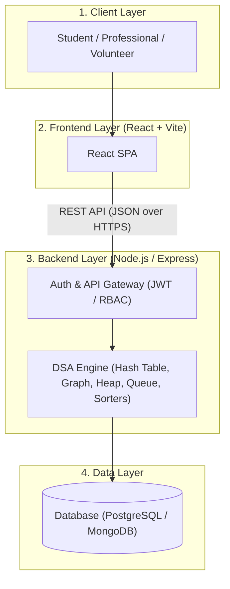

# Local Skill Exchange and Community Learning Platform

A peer-to-peer learning platform connecting students, professionals, and volunteers within universities and local communities — built with real-world Data Structures & Algorithms (DSA) at its core.

---

## Table of Contents
- [About the Project](#about-the-project)
- [Motivation](#motivation)
- [Target Users](#target-users)
- [Core Features](#core-features)
- [Data Structures & Algorithms Core](#data-structures--algorithms-core)
- [System Architecture](#system-architecture)
- [API Overview](#api-overview)
- [Project Structure](#project-structure)
- [Getting Started](#getting-started)
- [Team & Roadmap](#team--roadmap)

---

## About the Project

The **Local Skill Exchange and Community Learning Platform** is a full-stack web application that enables people to teach and learn skills from each other within their local community or university. Users can create skill profiles, search for mentors, book learning sessions, build reputation through peer reviews, and receive personalized mentor recommendations.

Built as part of a computer science curriculum project, every core feature is powered by a specific, well-documented data structure or algorithm rather than relying solely on generic database queries.

---

## Motivation

Finding the right mentor or peer to learn a new skill from is often challenging, especially outside formal educational institutions. This platform fosters peer-to-peer learning by making it seamless to discover people with matching skills, connect through direct mentorship networks, and build a verified track record of teaching and learning within the community.

---

## Target Users

- **Students**: Seeking academic peer support, exam prep, and practical project skills.
- **Professionals**: Sharing industry expertise, career insights, and specialized technical knowledge.
- **Volunteers**: Facilitating community workshops and accessible tutoring programs.

---

## Core Features

| Feature | Description |
| :--- | :--- |
| **Skill Profiles** | Users create detailed profiles listing skills they can teach and topics they want to learn. |
| **Mentor Search** | Search for mentors filtered by skill category, experience level, and availability. |
| **Session Booking** | Schedule, manage, and confirm 1:1 or group learning sessions. |
| **Reputation System** | Community ratings and reviews establish trust and verify mentorship quality. |
| **Recommendation Engine** | Suggests optimal mentor matches based on composite scoring algorithms. |
| **Learning History** | Comprehensive tracking of past sessions, topics covered, and progress over time. |

---

## Data Structures & Algorithms Core

| Feature | Data Structure / Algorithm | Purpose & Complexity |
| :--- | :--- | :--- |
| **Skill Profile Lookup** | **Hash Table** | $O(1)$ average-case lookup of user profiles by skill keywords. |
| **Mentor Network Discovery** | **Graph + BFS/DFS Traversal** | Models peer connections; BFS finds shortest network paths, DFS finds skill clusters. |
| **Recommendation Ranking** | **Heap (Priority Queue)** | Keeps top-$k$ mentor recommendations efficiently sorted by composite score. |
| **Session Booking Pipeline** | **FIFO Queue** | Processes booking requests chronologically to prevent scheduling collisions. |
| **Search & Filtering** | **Sorting & Searching Algorithms** | Efficiently orders and filters mentor listings by rating, proximity, and relevance. |

---

## System Architecture

The application is structured into a modular **4-layer architecture**:

1. **Client Layer**: Browser-based interface used by students, professionals, and volunteers.
2. **Frontend Layer**: React + Vite Single Page Application (SPA) managing client state and routing.
3. **Backend Layer**: Node.js / Express service comprising:
   - **Auth & API Gateway**: JWT authentication, Role-Based Access Control (RBAC), input validation.
   - **DSA Engine**: Core algorithmic engine implementing Hash Tables, Graphs, Heaps, and Queues.
4. **Data Layer**: PostgreSQL / MongoDB for persistent records with optional Redis caching.



> 📖 **Full Architectural Documentation**: For in-depth architectural specifications, complete sequence diagrams, database ER diagrams, and REST API contract details, refer to [docs/ARCHITECTURE.md](docs/ARCHITECTURE.md).

---

## API Overview

The backend exposes a stateless REST API consumed by the frontend client:

| HTTP Method | Endpoint | Description |
| :--- | :--- | :--- |
| `POST` | `/api/auth/register` | Register a new user account |
| `POST` | `/api/auth/login` | Authenticate user and issue JWT |
| `GET` | `/api/skills/search?query=` | Search mentors by skill keyword |
| `GET` | `/api/users/:id` | Fetch user profile and skill set |
| `PUT` | `/api/users/:id/skills` | Update user's taught/wanted skills |
| `GET` | `/api/recommendations/:userId` | Get ranked mentor recommendations |
| `POST` | `/api/sessions/book` | Enqueue a session booking request |
| `GET` | `/api/users/:id/history` | Fetch past sessions and learning history |
| `POST` | `/api/reviews` | Submit rating and review for a session |

See [docs/ARCHITECTURE.md](docs/ARCHITECTURE.md#6-rest-api-contract) for full request/response schemas.

---

## Project Structure

```
.
├── docs/
│   └── ARCHITECTURE.md    # Complete 4-layer system architecture & specifications
├── frontend/
│   └── README.md          # React + Vite frontend application overview
├── backend/
│   └── README.md          # Node.js / Express backend & DSA engine overview
└── README.md              # Project overview and entry point
```

---

## Getting Started

*(Installation, local development setup instructions, and prerequisites will be documented here as development progresses.)*

---

## Team & Roadmap

- **Team**: CSC210 Group 5
- **Status**: System Architecture & Specification Phase Complete
