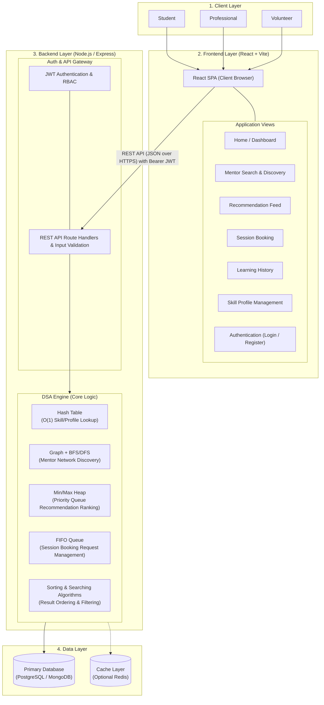
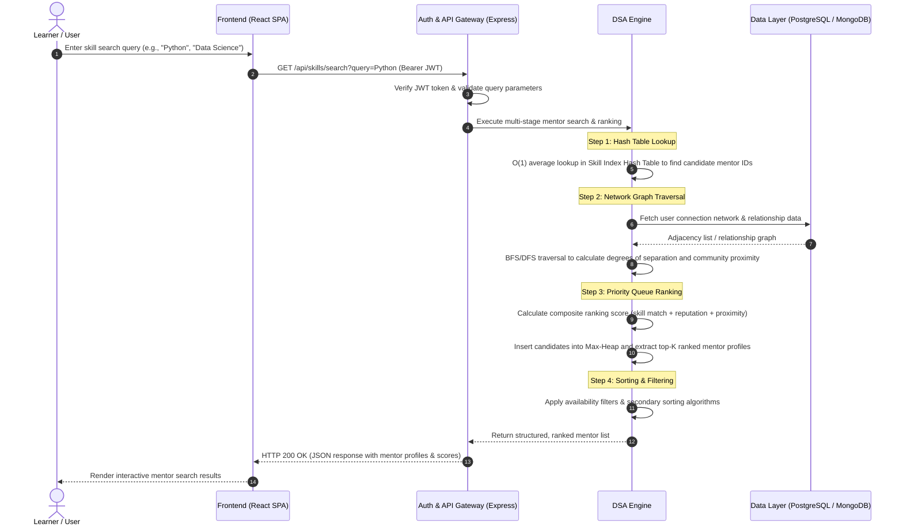
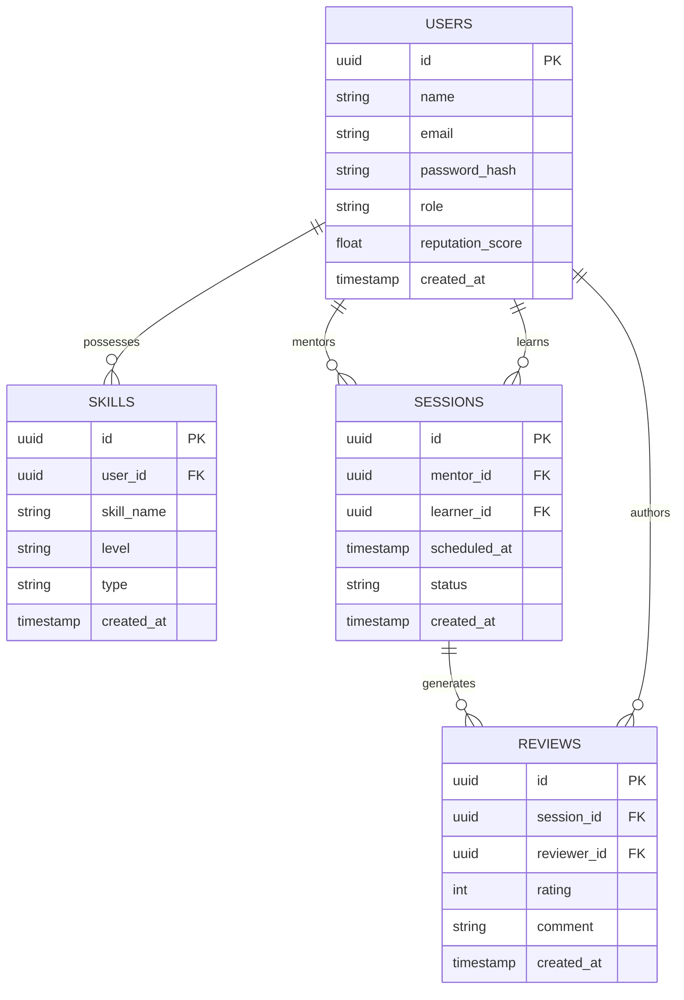

# System Architecture

## 1. System Overview

The **Local Skill Exchange and Community Learning Platform** is a distributed, full-stack web application designed for peer-to-peer knowledge sharing and collaborative mentoring among students, professionals, and volunteers. 

Unlike conventional web platforms that rely solely on declarative database queries for business logic, this platform implements custom, deterministic **Data Structures and Algorithms (DSA)** at its core to power skill indexing, network discovery, mentor recommendation ranking, request scheduling, and search optimization.

---

## 2. 4-Layer Architecture

The system is organized into four distinct architectural layers, ensuring separation of concerns, modularity, and scalability:

### Layer 1: Client Layer
- Serves three primary persona groups:
  - **Students**: Seeking academic peer support, exam prep, and technical skills.
  - **Professionals**: Sharing industry expertise, career guidance, and specialized domain knowledge.
  - **Volunteers**: Facilitating community learning workshops and non-profit tutoring initiatives.
- Accesses the system through modern desktop and mobile web browsers.

### Layer 2: Frontend Layer (React + Vite)
- Built as a modern Single Page Application (SPA) using React and Vite for optimal build performance and developer experience.
- Implements declarative client-side routing across key functional views:
  - **Home / Dashboard**: Overview of ongoing sessions, upcoming bookings, and community stats.
  - **Mentor Search & Discovery**: Interactive query interface for filtering mentors by skill, level, and availability.
  - **Recommendations Feed**: Personalized mentor match suggestions based on user interest profiles.
  - **Session Booking UI**: Calendar scheduling interface for 1:1 and group peer sessions.
  - **Learning History**: Comprehensive log of completed sessions, learning hours, and milestones.
  - **Skill Profile Management**: Interface for managing taught skills and desired learning topics.
  - **Login / Register**: Secure authentication and onboarding flows.
- Communicates exclusively with the backend via a stateless RESTful API (JSON over HTTPS).
- Manages JSON Web Tokens (JWT) client-side for authenticated API requests using standard `Authorization: Bearer <token>` headers.

### Layer 3: Backend Layer (Node.js / Express)
The backend service is structured into two primary subsystems:

1. **Auth & API Gateway**:
   - Manages user registration, password hashing (bcrypt), and token generation/verification (JWT).
   - Enforces Role-Based Access Control (RBAC) across protected endpoints.
   - Performs comprehensive request sanitization, schema validation, and error handling.
   - Routes validated incoming requests to corresponding handlers in the DSA Engine.

2. **DSA Engine (Algorithmic Core)**:
   - Contains explicit, standalone implementations of data structures and algorithms.
   - Designed to maintain high computational efficiency under concurrent user workloads.
   - Operates on in-memory representations populated and synced with the persistent data layer.

### Layer 4: Data Layer
- **Primary Database**: PostgreSQL (relational) or MongoDB (document store) for persistent storage of user profiles, skill records, scheduled sessions, and reviews.
- **Cache Layer (Optional)**: Redis for caching frequently requested skill indices, active session queues, and warm graph neighborhoods.

---

## 3. DSA Engine Modules & Complexity

| Sub-Component | Data Structure / Algorithm | Time Complexity | Purpose & Operational Mechanics |
| :--- | :--- | :---: | :--- |
| **Skill & Profile Index** | Hash Table (Chained / Open Addressing) | $O(1)$ avg lookup $O(1)$ avg insertion | Maps skill tokens to user profile sets for instantaneous keyword and category lookups without full table scans. |
| **Mentor Discovery Network** | Graph (Adjacency List) + BFS/DFS Traversal | $O(V + E)$ traversal | Models user connections and shared community circles. BFS discovers shortest path connections; DFS identifies skill clusters. |
| **Recommendation Engine** | Max-Heap / Priority Queue | $O(n)$ heapify $O(k \log n)$ top-$k$ | Ranks candidate mentors based on a composite affinity score (skill overlap, reputation rating, network proximity). |
| **Session Booking Pipeline** | FIFO Queue | $O(1)$ enqueue $O(1)$ dequeue | Manages incoming booking requests in strict chronological order to avoid race conditions and double-booking. |
| **Search & Filtering Engine** | Multi-key Sorting & Binary / Substring Search | $O(n \log n)$ sort $O(\log n)$ search | Orders mentor listings by rating, availability windows, and matching relevance scores. |

---

## 4. End-to-End Request Flow: Mentor Search

The sequence diagram below traces the end-to-end execution of a mentor search query, illustrating how the API Gateway and the DSA Engine orchestrate data structures to deliver ranked results:

---

## 5. Database Schema & Entity Relationships

The data layer models core application entities with clear relational constraints and indexing strategies:

### Entity Definitions
- **`USERS`**: Stores user authentication credentials, identity information, role (`student`, `professional`, `volunteer`), and aggregated community reputation score.
- **`SKILLS`**: Stores individual skills associated with users, categorized by skill level (`beginner`, `intermediate`, `advanced`) and classification (`teach` vs `learn`).
- **`SESSIONS`**: Tracks scheduled learning interactions, linking mentor and learner user IDs with timestamps and lifecycle status (`pending`, `confirmed`, `completed`, `cancelled`).
- **`REVIEWS`**: Records peer evaluations, numerical ratings (1–5 scale), and qualitative feedback generated upon session completion.

---

## 6. REST API Contract

The communication contract between the Frontend Single Page Application and the Backend API Gateway is defined as follows:

| HTTP Method | Endpoint | Description | Auth Required | Request Body / Query Params | Success Response (JSON) |
| :--- | :--- | :--- | :---: | :--- | :--- |
| `POST` | `/api/auth/register` | Register a new user account | No | `{ "name": "...", "email": "...", "password": "...", "role": "..." }` | `201 Created` `{ "token": "...", "user": { "id": "...", "name": "...", "email": "...", "role": "..." } }` |
| `POST` | `/api/auth/login` | Authenticate user and issue JWT | No | `{ "email": "...", "password": "..." }` | `200 OK` `{ "token": "...", "user": { "id": "...", "name": "...", "email": "...", "role": "..." } }` |
| `GET` | `/api/skills/search?query=` | Search mentors by skill keyword | Yes | Query param: `query` (string) | `200 OK` `[ { "user": { ... }, "skills": [ ... ], "score": 94.5 } ]` |
| `GET` | `/api/users/:id` | Retrieve user profile, skills, and reviews | Yes | URL param: `id` (uuid) | `200 OK` `{ "id": "...", "name": "...", "skills": [ ... ], "reputation_score": 4.8 }` |
| `PUT` | `/api/users/:id/skills` | Update user's taught and wanted skills | Yes | `{ "skills": [ { "skill_name": "...", "level": "...", "type": "teach" } ] }` | `200 OK` `{ "message": "Skills updated", "skills": [ ... ] }` |
| `GET` | `/api/recommendations/:userId` | Get ranked mentor recommendations | Yes | URL param: `userId` (uuid) | `200 OK` `[ { "mentor": { ... }, "score": 98.2, "rank": 1 } ]` |
| `POST` | `/api/sessions/book` | Enqueue a session booking request | Yes | `{ "mentor_id": "...", "scheduled_at": "...", "notes": "..." }` | `201 Created` `{ "session": { "id": "...", "status": "pending", "scheduled_at": "..." } }` |
| `GET` | `/api/users/:id/history` | Retrieve past sessions and learning history | Yes | URL param: `id` (uuid) | `200 OK` `[ { "session": { ... }, "partner": { ... }, "review": { ... } } ]` |
| `POST` | `/api/reviews` | Submit rating and review for a session | Yes | `{ "session_id": "...", "rating": 5, "comment": "..." }` | `201 Created` `{ "review": { "id": "...", "rating": 5, "comment": "..." } }` |

---

## 7. Security and Communication Protocols

- **Transport Security**: All API traffic is strictly served over HTTPS with TLS 1.3 encryption.
- **Authentication**: Stateless JSON Web Tokens (JWT) signed with HMAC-SHA256, carrying user ID and role claims with standardized expiration windows.
- **Authorization**: Middleware-enforced Role-Based Access Control (RBAC) verifying endpoint permissions before invoking backend logic.
- **Data Validation & Sanitization**: Strict input validation using schema validators to mitigate SQL injection, NoSQL injection, and cross-site scripting (XSS).
