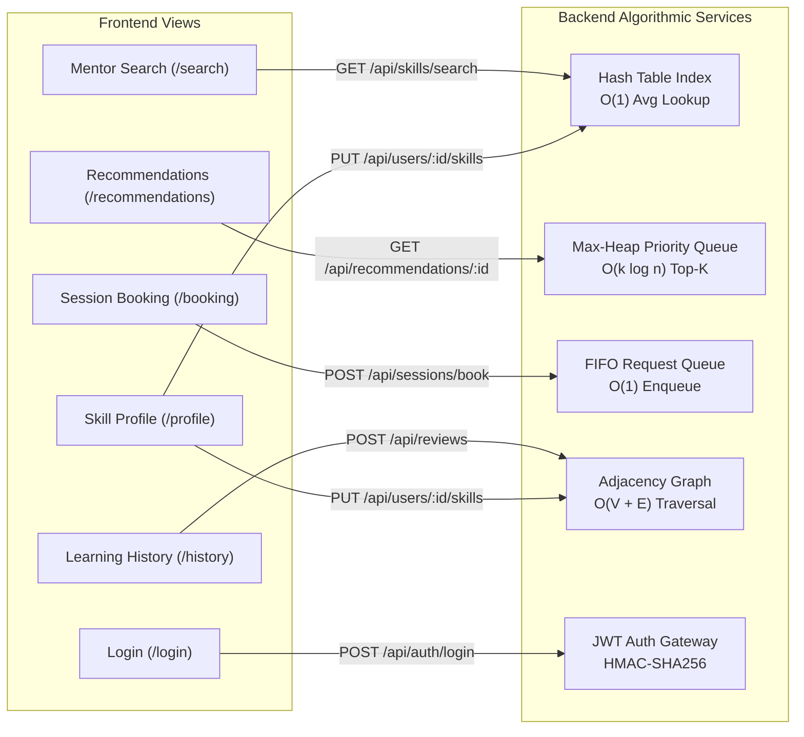
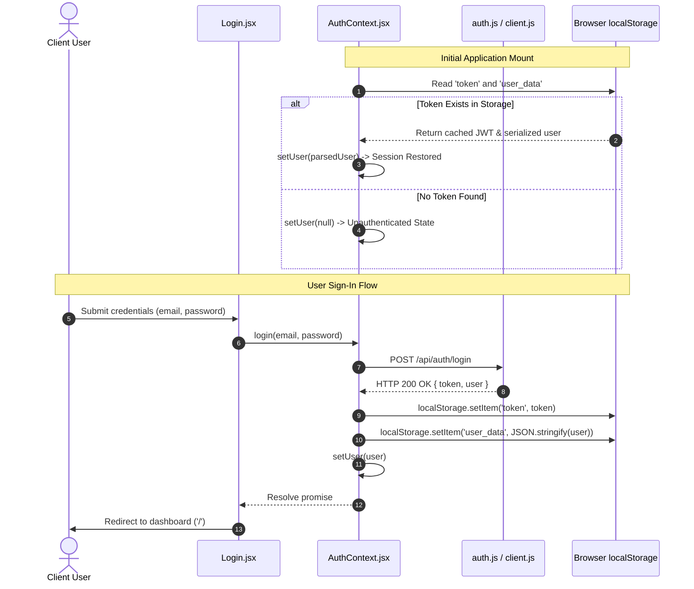

# Frontend Architecture & Technical Implementation Notes

## 1. Architectural Overview

The **Local Skill Exchange and Community Learning Platform** frontend is a Single Page Application (SPA) developed with **React 18** and **Vite**. The client interface serves three primary community roles: **Students**, **Professionals**, and **Volunteers**.

The frontend architecture prioritizes:
- **Direct Algorithmic Integration**: Every functional view maps directly to a discrete Data Structure or Algorithm (DSA) service in the backend layer.
- **Predictable State Management**: Global state is constrained to authentication and session lifecycle using native React Context.
- **Modular Service Layer**: HTTP networking, JWT injection, and error normalization are encapsulated in a resource-oriented API client layer.
- **Robust UI Feedback**: Standardized visual indicators for loading, empty datasets, network errors, and offline fallback modes.

---

## 2. Page Architecture & Backend DSA Mapping



### 2.1 View Specifications

| View Component | Route | Primary Responsibility | Connected Backend DSA Engine Feature | Complexity & Operational Mechanics |
| :--- | :--- | :--- | :--- | :--- |
| **Home (`Home.jsx`)** | `/` | Application overview, operational metrics, and navigation hub. | **System Aggregator** | Surfaces aggregate metrics from underlying Hash Tables, Graph networks, and Queue pipelines. |
| **Mentor Search (`MentorSearch.jsx`)** | `/search` | Keyword-driven mentor discovery by skill and subject tags. | **Hash Table Skill Index** | Calls `GET /api/skills/search?query=...`. The backend queries an in-memory chained Hash Table index mapping skill tokens to sets of mentor identifiers, achieving **$O(1)$ average-case lookup** without full-table scans. |
| **Recommendations (`Recommendations.jsx`)** | `/recommendations` | Personalized mentor suggestions feed ranked by composite affinity. | **Max-Heap (Priority Queue)** | Calls `GET /api/recommendations/:userId`. The backend computes a composite affinity score (skill overlap, reputation rating, and network proximity) and inserts candidate mentors into a **Max-Heap** to extract the **top-$k$ matches in $O(k \log n)$** time. |
| **Session Booking (`SessionBooking.jsx`)** | `/booking` | Mentorship scheduling interface for 1:1 and group sessions. | **FIFO Queue Pipeline** | Calls `POST /api/sessions/book`. Booking requests enter a strict **First-In, First-Out (FIFO) Queue** in $O(1)$ time to process scheduling transactions sequentially and prevent double-booking collisions. |
| **Learning History (`LearningHistory.jsx`)** | `/history` | Chronological session timeline and post-session peer review portal. | **Mentor Network Graph** | Calls `GET /api/users/:id/history` and `POST /api/reviews`. Submitting verified reviews modifies relationship edge weights and reputation scores within the **Adjacency Graph**. |
| **Skill Profile (`SkillProfile.jsx`)** | `/profile` | Profile editor for taught skills (with proficiency levels), learning goals, and bio. | **Hash Table & Graph Node Updates** | Calls `PUT /api/users/:id/skills`. Modifies user vertex properties in the **Adjacency Graph** and re-indexes taught tokens in the **Hash Table**. |
| **Login (`Login.jsx`)** | `/login` | User authentication portal with demo persona shortcuts. | **JWT Auth & API Gateway** | Calls `POST /api/auth/login`. Authenticates credentials, validates hashed passwords (bcrypt), and issues a signed JSON Web Token. |

---

## 3. State Management & Authentication Lifecycle

### 3.1 Design Rationale: React Context vs External State Libraries

Global state is managed via React's native **Context API** (`src/context/AuthContext.jsx`) rather than external libraries such as Redux or Zustand.

- **Zero Additional Overhead**: Avoids introducing external runtime dependencies for state that is predominantly read-only across most views.
- **Single Source of Truth**: Authentication status (`user`, `token`, `isLoading`, `isAuthenticated`) is consolidated into a single provider wrapping the root component tree.
- **Maintainability**: Context paired with standard `useState` and `useEffect` produces clean, auditable code with minimal boilerplate.

### 3.2 Authentication Flow & Persistence



### 3.3 Session Restoration Mechanics
1. **Hydration**: When the application loads, `AuthContext` executes a `useEffect` hook that checks `localStorage` for `token` and `user_data`.
2. **Consistency**: If valid serialized data exists, the `user` state is populated before children render, preventing authentication flicker.
3. **Termination**: Invoking `logout()` purges both storage keys and resets `user` to `null`.

---

## 4. API Layer & Service Architecture

The frontend abstracts all backend communication into a dedicated service layer under `src/api/`.

```
src/api/
├── client.js           # Central HTTP fetch wrapper, JWT injection, & error parsing
├── auth.js             # User authentication and profile retrieval endpoints
├── skills.js           # Skill search indexing and profile skill updates
├── sessions.js         # Booking queue dispatch and session history retrieval
└── recommendations.js  # Algorithmic recommendation queries
```

### 4.1 Architectural Advantages
1. **Resource Decoupling**: UI components remain decoupled from HTTP concerns (headers, serialization, status codes) and interact exclusively with typed async functions.
2. **Unified Interception**: `client.js` automatically attaches the active JWT to the `Authorization: Bearer <token>` header for all outgoing requests.
3. **Endpoint Maintainability**: Base URLs and route paths are maintained in single resource files, ensuring that backend API refactoring does not require changes to UI components.

---

## 5. Fault Tolerance & Offline Fallback Architecture

### 5.1 Design Purpose
In distributed web systems, frontend clients should maintain operational stability during transient backend outages, network partitions, or offline demonstration scenarios.

### 5.2 Implementation
1. **Error Interception**: `src/api/client.js` wraps standard `fetch()` invocations in structured `try...catch` blocks.
2. **Graceful Fallback**: If the backend service is unreachable (e.g. `ERR_CONNECTION_REFUSED`), the client serves realistic in-memory dataset fixtures and flags the response payload with `isMock: true`.
3. **Visual Transparency (`DemoBanner`)**:
   - Whenever `isMock: true` is detected, components render the `DemoBanner` component:
     ```
     [DEMO MODE] Backend Offline: Displaying simulated local data for live demonstration.
     ```
   - This prevents ambiguous system states and guarantees transparent operation during technical evaluations.

---

## 6. Key Engineering Decisions & Trade-Offs

### 6.1 Functional Components & Hooks
All components are implemented as functional components utilizing standard React hooks (`useState`, `useEffect`, `useContext`, `useSearchParams`, `useNavigate`). This ensures concise lifecycle management, predictable re-renders, and full compatibility with React 18 concurrent features.

### 6.2 Client-Side Validation
Forms (e.g. `SkillProfile.jsx`, `SessionBooking.jsx`) execute client-side validation prior to network dispatch:
- **Duplicate Prevention**: `SkillProfile.jsx` validates skill names against existing entries using `Array.prototype.some()` to prevent duplicate tag allocations.
- **Temporal Validation**: `SessionBooking.jsx` validates both date and time inputs and formats them to ISO 8601 strings (`new Date(...).toISOString()`) before enqueuing.

### 6.3 Modular Feedback Hierarchy
UI states are separated into discrete, declarative feedback components (`src/components/Feedback.jsx`):
- `<Loader />`: Asynchronous request pending state.
- `<EmptyState />`: Zero-result dataset presentation with context-specific recovery actions.
- `<ErrorState />`: Structured error presentation with retry callbacks.
- `<SuccessState />`: Positive mutation confirmations.
- `<DemoBanner />`: Explicit offline demonstration indicator.
